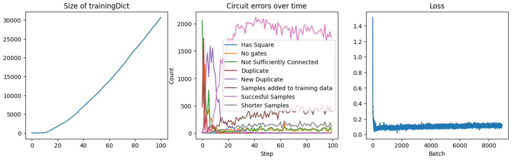

# Bootstrapping Generative AI

Thesis on using Generative AI to generate its own training data through a bootstrapping process. Synthetic data can have adverse effects on generative models, which in this thesis is mitigated by using quality measures / fitness scores of the generated samples, and adding constraints to the generated circuits that ensure the generative model learns from only applicable synthetic samples.

The thesis is available as <a href="/Mathias-MasterThesis-1.pdf" class="image fit">Mathias-MasterThesis-1.pdf</a>

This repository contains various scripts and notebooks for running experiments on bootstrapping generative AI. The experiments are performed on a domain of generating circuits in the form of images using a Denoising Diffusion Model

Through bootstrapping, an initial dataset of 4 smamples of circuits were extended to contain ~30.000 synthetic samples, that align with constraints of the domina.

